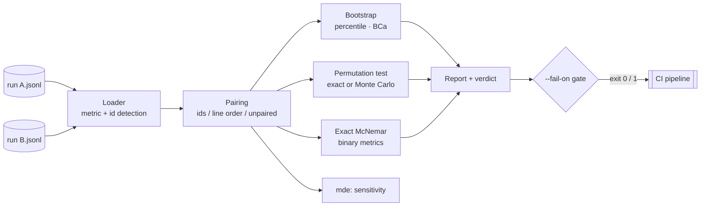

# bootsig

[English](README.md) | [中文](README.zh.md) | [日本語](README.ja.md)

[](LICENSE) [](CHANGELOG.md) [](pyproject.toml)  [](CONTRIBUTING.md)

**eval 実行結果のためのオープンソース有意性検定 — 2 つの JSONL ファイルへの 1 コマンドで、73% が本当に 71% に勝っているのかを bootstrap 信頼区間と並べ替え検定で答える。**


```bash
git clone https://github.com/JaydenCJ/bootsig && cd bootsig && pip install -e .
```

> **プレリリース：** bootsig はまだ PyPI に公開されていません。最初のリリースまでは [JaydenCJ/bootsig](https://github.com/JaydenCJ/bootsig) をクローンし、リポジトリのルートで `pip install -e .` を実行してください。

## なぜ bootsig？

新しい実行が 73%、古いのが 71% だったという理由でチームは prompt の変更を出荷する — しかし 100 サンプルではその差はコイン投げだ（下のデモデータに対して bootsig は p = 0.84 を返す）。これを検証する統計手法は何十年も前からあるのに、notebook の中に住んでいる：配列を手で組み立て、どの検定に対応付けが要るかを思い出し、ありえない p = 0 を報告しないよう気を付け、次の eval でまた全部書き直す。bootsig はその notebook を、eval が既に出力している JSONL ファイルへの 1 つの決定的なコマンドに変えた：サンプルを id で対応付け、正しい検定を選び、BCa bootstrap 区間と可能な限り正確な並べ替え p 値を報告し、`bootsig mde` によってその eval がそもそも検出できる差の大きさまで教える。モデルは動かさず、API も呼ばず、依存はゼロ：もう 1 つの eval runner やダッシュボードには意図的に**ならず**、どの runner の後にも欠けている有意性検定という一歩だけを埋める。

|  | bootsig | SciPy + notebook | statsmodels | promptfoo |
|---|---|---|---|---|
| eval 結果ファイルを直接扱える | JSONL パス 2 つ | 配列は自分で組む | DataFrame は自分で組む | eval 自体を再実行 |
| サンプル対応付きのペア分析 | id で自動マッチ | 自分でやる | 自分でやる | なし |
| 決してゼロにならない p 値 | 加一補正を内蔵 | コード次第 | 漸近手法がデフォルト | 有意性検定なし |
| この eval に何が見える？（MDE） | `bootsig mde` | 自分でやる | power クラスを自分で組む | なし |
| 有意な劣化での CI ゲート | `--fail-on regression`、終了コード 1 | 自分でやる | 自分でやる | アサーションのみで有意性なし |
| ランタイム依存 | 0 | 1 | 5 | 100+（npm） |

<sub>依存数は 2026-07 時点で各プロジェクトが宣言するランタイム依存：SciPy 1.x（1：NumPy）、statsmodels 0.14（5：NumPy、SciPy、pandas、patsy、packaging）、promptfoo 0.11x（100+ の推移的 npm パッケージ）。bootsig の数は [pyproject.toml](pyproject.toml) の `dependencies = []` そのものです。</sub>

## 機能

- **1 コマンドで本当の答え** — `bootsig compare a.jsonl b.jsonl` が平均、BCa bootstrap 信頼区間、並べ替え検定の p 値、勝ち/負け/引き分けの数、効果量、そして指定した alpha での平易な結論を出力。
- **当てずっぽうを拒むペア検定** — サンプルは id でマッチ（自動検出または `--id`）；行順での対応付けは安全だと証明できる場合のみで、曖昧なケースはすべて修正のヒント付きで大声で失敗し、静かにずれることは決してない。
- **必要なところは厳密に** — 並べ替え空間が `min(--resamples, 100000)` に収まるときは完全列挙（変化したサンプルが少ないときによくある）；それ以外は加一補正付きの Monte Carlo p 値で、bootsig が p = 0 を報告することはない。二値メトリクスには正確 McNemar 検定も自動で付く。
- **eval に見えないものを知っている** — `bootsig mde` は現在の n での最小検出可能差と、知りたい差に必要な n を報告し、50 サンプルの eval が 2 ポイントの論争を裁くのをやめさせる。
- **決定的で CI 対応** — 同じファイルと同じフラグならバイト単位で同一のレポート（シード付き RNG、フッターに全パラメータを記録）；`--fail-on regression` は終了コード 1、`--json` はキーをソートした機械可読出力。
- **依存ゼロ、完全オフライン** — 純粋な標準ライブラリで、モデルなし、API なし、テレメトリなし；統計の実装はモジュールごとに 1 画面で監査でき、[`docs/methodology.md`](docs/methodology.md) に文書化。

## クイックスタート

インストール：

```bash
git clone https://github.com/JaydenCJ/bootsig && cd bootsig && pip install -e .
```

同梱の 2 つのデモ実行を比較する — 候補 prompt は 73% 対 71% で「勝って」いる：

```bash
bootsig compare examples/baseline.jsonl examples/candidate.jsonl
```

```text
bootsig compare — paired analysis of metric "score"

  A  examples/baseline.jsonl    n=100   mean 0.7100   95% CI [0.6100, 0.7900]
  B  examples/candidate.jsonl   n=100   mean 0.7300   95% CI [0.6300, 0.8100]

  pairing              100 pairs matched on id key "id" (0 unmatched)
  wins / losses / ties 13 / 11 / 76   (B better / A better / tied)

  difference (B - A)   +0.0200   95% CI [-0.0700, +0.1200]   (+2.8% relative)
  permutation test     p = 0.8375   (sign-flip, 10000 resamples)
  exact McNemar        p = 0.8388   (24 discordant pairs)
  effect size          Cohen's d = 0.04 (paired)

  verdict: NOT SIGNIFICANT at alpha = 0.05 (p = 0.8375) — a +0.0200 difference at n=100 is within noise

  seed 42 · bca bootstrap, 10000 resamples · bootsig 0.1.0
```

本物の改善は違う姿をしている（`examples/improved.jsonl` は 13 ポイントの向上）：

```bash
bootsig compare examples/baseline.jsonl examples/improved.jsonl
```

```text
  difference (B - A)   +0.1300   95% CI [+0.0517, +0.2200]   (+18.3% relative)
  permutation test     p = 0.0051   (sign-flip, 10000 resamples)

  verdict: SIGNIFICANT at alpha = 0.05 — B improves on A by +0.1300 (p = 0.0051)
```

そして `bootsig mde` は、最初の比較に最初から勝ち目がなかった理由を説明する：

```text
  minimum detectable difference at n=100: ±0.1378
  → real differences smaller than ±0.1378 will usually go undetected.

  observed difference is +0.0200; detecting a true difference of that size needs n ≈ 4749 pairs.
```

上の出力はすべて実際の実行からのコピー；`scripts/smoke.sh` とテストスイートがこれらの正確な数値をアサートします。

## 入力フォーマット

1 行に 1 つの JSON オブジェクト、1 行に 1 サンプル — eval フレームワークが既に出力している形式そのもの。bootsig に必要なのは数値またはブールの**メトリクス**と、できれば安定した**id**；どちらもドット区切りのキーパスで、どちらも自動検出されます：

| 対象 | 自動検出されるキー | 上書き方法 |
|---|---|---|
| メトリクス（数値/ブール） | `score`、`correct`、`passed`、`accuracy`、`value` | `--metric metrics.exact_match` |
| サンプル id | `id`、`example_id`、`task_id`、`case_id`、`name` | `--id input_hash` |

メトリクスの欠損/null はデフォルトでエラー（`--missing skip` でその行を除外）；型違いのメトリクス、NaN、重複 id、片側だけ id を持つ実行は常にエラーで、メッセージにファイル名と行番号が入ります。

## CLI リファレンス

| コマンド | 効果 |
|---|---|
| `bootsig compare A B` | 2 実行の完全な有意性レポート；`--fail-on` のゲート発動時は終了コード 1 |
| `bootsig inspect RUN` | 単一実行のサマリ：n、平均、標準偏差、平均の信頼区間、ヒストグラム |
| `bootsig mde RUN [RUN2]` | 最小検出可能差と必要サンプル数の推定 |

主要オプション（これらを与えればすべてのコマンドは決定的）：

| Key | Default | Effect |
|---|---|---|
| `--resamples` | `10000` | bootstrap/並べ替えの再標本数；厳密列挙の予算でもある |
| `--seed` | `42` | RNG シード；同じ入力とフラグでレポートをバイト単位で再現 |
| `--alpha` | `0.05` | 結論と信頼区間のカバレッジに使う有意水準 |
| `--ci-method` | `bca` | `bca`（バイアス補正・加速）または `percentile` 区間 |
| `--unpaired` | オフ | 2 実行を独立標本として扱う（サンプル集合が異なる場合） |
| `--lower-is-better` | オフ | コスト型メトリクス（レイテンシ、loss）：改善/劣化の向きを反転 |
| `--fail-on` | `none` | `regression` または `difference`：有意なら終了コード 1 |
| `--json` | オフ | キーをソートした機械可読出力 |

終了コード：`0` 成功（またはゲート通過）、`1` ゲート発動、`2` 用法またはデータのエラー。

## 検証

このリポジトリは CI を同梱しません；上記の主張はすべてローカル実行で検証されています。このリポジトリのチェックアウトから再現するには：

```bash
pip install -e '.[dev]' && pytest && bash scripts/smoke.sh
```

出力（実際の実行からコピー、`...` で省略）：

```text
90 passed in 1.41s
...
[smoke] --fail-on regression gates correctly in both directions
[smoke] --json payload validates
SMOKE OK
```

## アーキテクチャ



## ロードマップ

- [x] ペア/非ペア比較（BCa bootstrap、厳密/Monte Carlo 並べ替え、McNemar）、inspect、mde、CI ゲート、JSON 出力（v0.1.0）
- [ ] PyPI への公開、`pip install bootsig` 対応
- [ ] 多重比較補正（Holm、Benjamini-Hochberg）：多数の候補を 1 つのベースラインと一括比較するために
- [ ] 平均以外の統計量：中央値、トリム平均、pass^k
- [ ] `--group-by category`：1 組のファイルからスライスごとの結論を出す
- [ ] 裾の重いメトリクス向けのスチューデント化 bootstrap 区間

完全なリストは [open issues](https://github.com/JaydenCJ/bootsig/issues) を参照。

## コントリビュート

コントリビュートを歓迎します — 出典付きの統計的な修正こそ完璧な最初の PR です。[good first issue](https://github.com/JaydenCJ/bootsig/issues?q=is%3Aissue+is%3Aopen+label%3A%22good+first+issue%22) から始めるか、[discussion](https://github.com/JaydenCJ/bootsig/discussions) を開いてください。開発環境の構築は [CONTRIBUTING.md](CONTRIBUTING.md) を参照。

## ライセンス

[MIT](LICENSE)
