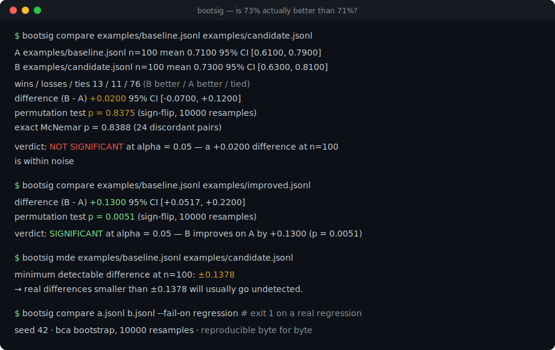
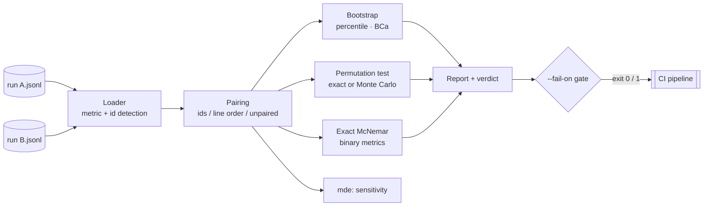

# bootsig

[English](README.md) | [中文](README.zh.md) | [日本語](README.ja.md)

[](LICENSE) [](CHANGELOG.md) [](pyproject.toml)  [](CONTRIBUTING.md)

**Open-source significance testing for eval runs — one command over two JSONL files tells you whether 73% actually beats 71%, with bootstrap confidence intervals and permutation tests.**



```bash
git clone https://github.com/JaydenCJ/bootsig && cd bootsig && pip install -e .
```

> **Pre-release:** bootsig is not yet published to PyPI. Until the first release, clone [JaydenCJ/bootsig](https://github.com/JaydenCJ/bootsig) and run `pip install -e .` from the repository root.

## Why bootsig?

Teams ship prompt changes because the new run scored 73% and the old one scored 71% — on 100 examples, where that gap is a coin flip (bootsig puts p at 0.84 for the demo data below). The statistics to check this have existed for decades, but they live in notebooks: assemble arrays, remember which test needs pairing, avoid reporting an impossible p = 0, then rewrite it all for the next eval. bootsig is that notebook as one deterministic command over the JSONL files your eval already writes: it pairs examples by id, picks the right test, reports BCa bootstrap intervals and exact-when-possible permutation p-values, and tells you — via `bootsig mde` — the difference your eval is even capable of detecting. It runs no model, calls no API, and adds zero dependencies: it is deliberately **not** another eval runner or dashboard, only the missing significance step after any of them.

|  | bootsig | SciPy + notebook | statsmodels | promptfoo |
|---|---|---|---|---|
| Works directly on eval result files | Two JSONL paths | Arrays you assemble | DataFrames you assemble | Re-runs the eval itself |
| Paired analysis with example matching | Automatic, by id | Your job | Your job | No |
| p-values that are never zero | Add-one correction built in | Depends on your code | Asymptotic defaults | No significance testing |
| What can this eval detect? (MDE) | `bootsig mde` | Your job | Power classes, assemble yourself | No |
| CI gate on significant regression | `--fail-on regression`, exit 1 | Your job | Your job | Assertions without significance |
| Runtime dependencies | 0 | 1 | 5 | 100+ (npm) |

<sub>Dependency counts are the declared runtime requirements as of 2026-07: SciPy 1.x (1: NumPy), statsmodels 0.14 (5: NumPy, SciPy, pandas, patsy, packaging), promptfoo 0.11x (100+ transitive npm packages). bootsig's count is `dependencies = []` in [pyproject.toml](pyproject.toml).</sub>

## Features

- **One command, a real answer** — `bootsig compare a.jsonl b.jsonl` prints means, BCa bootstrap CIs, a permutation p-value, win/loss/tie counts, effect size, and a plain-language verdict at your alpha.
- **Paired tests that refuse to guess** — examples are matched by id (auto-detected or `--id`); line-order pairing is used only when provably safe, and every ambiguous case fails loudly with a fix hint instead of silently misaligning.
- **Exact where it matters** — when the permutation space fits in `min(--resamples, 100000)` it is enumerated completely (common when only a few examples changed); otherwise Monte Carlo p-values carry the add-one correction, so bootsig never reports p = 0. Binary metrics get an exact McNemar test for free.
- **Knows what your eval cannot see** — `bootsig mde` reports the minimum detectable difference at your n and the n required for the difference you care about, so 50-example evals stop deciding 2-point arguments.
- **Deterministic and CI-ready** — same files, same flags, byte-identical report (seeded RNG, footer records everything); `--fail-on regression` exits 1, `--json` emits sorted machine-readable output.
- **Zero dependencies, fully offline** — pure standard library, no model, no API, no telemetry; the statistics are auditable in one screen per module and documented in [`docs/methodology.md`](docs/methodology.md).

## Quickstart

Install:

```bash
git clone https://github.com/JaydenCJ/bootsig && cd bootsig && pip install -e .
```

Compare the two committed demo runs — the candidate prompt "wins" 73% to 71%:

```bash
bootsig compare examples/baseline.jsonl examples/candidate.jsonl
```

```text
bootsig compare — paired analysis of metric "score"

  A  examples/baseline.jsonl    n=100   mean 0.7100   95% CI [0.6100, 0.7900]
  B  examples/candidate.jsonl   n=100   mean 0.7300   95% CI [0.6300, 0.8100]

  pairing              100 pairs matched on id key "id" (0 unmatched)
  wins / losses / ties 13 / 11 / 76   (B better / A better / tied)

  difference (B - A)   +0.0200   95% CI [-0.0700, +0.1200]   (+2.8% relative)
  permutation test     p = 0.8375   (sign-flip, 10000 resamples)
  exact McNemar        p = 0.8388   (24 discordant pairs)
  effect size          Cohen's d = 0.04 (paired)

  verdict: NOT SIGNIFICANT at alpha = 0.05 (p = 0.8375) — a +0.0200 difference at n=100 is within noise

  seed 42 · bca bootstrap, 10000 resamples · bootsig 0.1.0
```

A real improvement looks different (`examples/improved.jsonl` gains 13 points):

```bash
bootsig compare examples/baseline.jsonl examples/improved.jsonl
```

```text
  difference (B - A)   +0.1300   95% CI [+0.0517, +0.2200]   (+18.3% relative)
  permutation test     p = 0.0051   (sign-flip, 10000 resamples)

  verdict: SIGNIFICANT at alpha = 0.05 — B improves on A by +0.1300 (p = 0.0051)
```

And `bootsig mde` explains why the first comparison never had a chance:

```text
  minimum detectable difference at n=100: ±0.1378
  → real differences smaller than ±0.1378 will usually go undetected.

  observed difference is +0.0200; detecting a true difference of that size needs n ≈ 4749 pairs.
```

All output above is copied from real runs; `scripts/smoke.sh` and the test suite assert these exact numbers.

## Input format

One JSON object per line, one line per example — the format eval harnesses already emit. bootsig needs a numeric or boolean **metric** and, ideally, a stable **id**; both are dotted key paths and both are auto-detected:

| What | Auto-detected keys | Override |
|---|---|---|
| Metric (number or bool) | `score`, `correct`, `passed`, `accuracy`, `value` | `--metric metrics.exact_match` |
| Example id | `id`, `example_id`, `task_id`, `case_id`, `name` | `--id input_hash` |

Absent/null metrics are errors by default (`--missing skip` drops those lines); wrong-typed metrics, NaN, duplicate ids, and half-identified runs are always errors, with the file and line number in the message.

## CLI reference

| Command | Effect |
|---|---|
| `bootsig compare A B` | Full significance report for two runs; exit 1 with `--fail-on` when gated |
| `bootsig inspect RUN` | One-run summary: n, mean, sd, CI of the mean, histogram |
| `bootsig mde RUN [RUN2]` | Minimum detectable difference and required-n estimates |

Key options (all commands are deterministic given these):

| Key | Default | Effect |
|---|---|---|
| `--resamples` | `10000` | Bootstrap/permutation resamples; also the exact-enumeration budget |
| `--seed` | `42` | RNG seed; identical inputs and flags reproduce reports byte for byte |
| `--alpha` | `0.05` | Significance level for the verdict and CI coverage |
| `--ci-method` | `bca` | `bca` (bias-corrected, accelerated) or `percentile` intervals |
| `--unpaired` | off | Treat runs as independent samples (different example sets) |
| `--lower-is-better` | off | Cost metrics (latency, loss): flips improvement/regression |
| `--fail-on` | `none` | `regression` or `difference`: exit 1 when significant |
| `--json` | off | Machine-readable output with sorted keys |

Exit codes: `0` success (or gate passed), `1` gate tripped, `2` usage or data error.

## Verification

This repository ships no CI; every claim above is verified by local runs. Reproduce them from a checkout of this repository:

```bash
pip install -e '.[dev]' && pytest && bash scripts/smoke.sh
```

Output (copied from a real run, truncated with `...`):

```text
90 passed in 1.41s
...
[smoke] --fail-on regression gates correctly in both directions
[smoke] --json payload validates
SMOKE OK
```

## Architecture



## Roadmap

- [x] Paired/unpaired compare (BCa bootstrap, exact/Monte Carlo permutation, McNemar), inspect, mde, CI gates, JSON output (v0.1.0)
- [ ] PyPI release with `pip install bootsig`
- [ ] Multiple-comparison correction (Holm, Benjamini-Hochberg) for sweeping many candidates against one baseline
- [ ] Statistics beyond the mean: median, trimmed mean, pass^k
- [ ] `--group-by category` for per-slice verdicts from one pair of files
- [ ] Studentized bootstrap intervals for heavy-tailed metrics

See the [open issues](https://github.com/JaydenCJ/bootsig/issues) for the full list.

## Contributing

Contributions are welcome — a statistical correction with a citation is the perfect first PR. Start with a [good first issue](https://github.com/JaydenCJ/bootsig/issues?q=is%3Aissue+is%3Aopen+label%3A%22good+first+issue%22) or open a [discussion](https://github.com/JaydenCJ/bootsig/discussions). See [CONTRIBUTING.md](CONTRIBUTING.md) for the development setup.

## License

[MIT](LICENSE)
