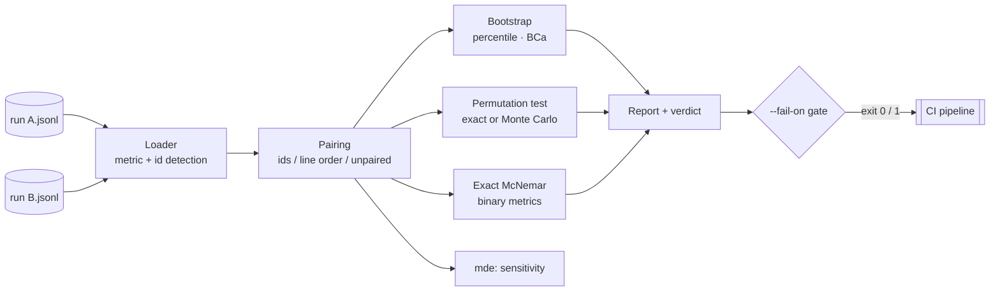

# bootsig

[English](README.md) | [中文](README.zh.md) | [日本語](README.ja.md)

[](LICENSE) [](CHANGELOG.md) [](pyproject.toml)  [](CONTRIBUTING.md)

**面向 eval 运行结果的开源显著性检验 — 对两个 JSONL 文件执行一条命令，用 bootstrap 置信区间和置换检验告诉你 73% 是否真的胜过 71%。**


```bash
git clone https://github.com/JaydenCJ/bootsig && cd bootsig && pip install -e .
```

> **预发布：** bootsig 尚未发布到 PyPI。在首个正式版本之前，请克隆 [JaydenCJ/bootsig](https://github.com/JaydenCJ/bootsig) 并在仓库根目录运行 `pip install -e .`。

## 为什么选择 bootsig？

团队上线一个 prompt 改动，理由是新运行得了 73%、旧的只有 71% —— 而在 100 个样例上，这个差距就是抛硬币（对下方演示数据，bootsig 给出的 p 值是 0.84）。检验这件事的统计方法已经存在几十年，但它们活在 notebook 里：手工拼数组、记住哪种检验需要配对、避免报出不可能的 p = 0，然后下一个 eval 再全部重写一遍。bootsig 把那个 notebook 变成对 eval 已经在产出的 JSONL 文件执行的一条确定性命令：按 id 配对样例、自动选对检验、报告 BCa bootstrap 区间和尽可能精确的置换 p 值，并通过 `bootsig mde` 告诉你这个 eval 到底能检测出多大的差异。它不跑模型、不调 API、零依赖：它刻意**不做**又一个 eval runner 或看板，只补上任何 runner 之后缺失的那一步显著性检验。

|  | bootsig | SciPy + notebook | statsmodels | promptfoo |
|---|---|---|---|---|
| 直接消费 eval 结果文件 | 两个 JSONL 路径 | 数组自己拼 | DataFrame 自己拼 | 自己重跑整个 eval |
| 按样例配对的分析 | 自动按 id 匹配 | 你自己做 | 你自己做 | 无 |
| 永不为零的 p 值 | 内置加一校正 | 取决于你的代码 | 默认渐近方法 | 无显著性检验 |
| 这个 eval 能看见什么？（MDE） | `bootsig mde` | 你自己做 | 有 power 类，需自己组装 | 无 |
| 显著回归时的 CI 门禁 | `--fail-on regression`，退出码 1 | 你自己做 | 你自己做 | 有断言但无显著性 |
| 运行时依赖 | 0 | 1 | 5 | 100+（npm） |

<sub>依赖数量为 2026-07 时各项目声明的运行时依赖：SciPy 1.x（1：NumPy）、statsmodels 0.14（5：NumPy、SciPy、pandas、patsy、packaging）、promptfoo 0.11x（100+ 传递性 npm 包）。bootsig 的数量即 [pyproject.toml](pyproject.toml) 中的 `dependencies = []`。</sub>

## 功能特性

- **一条命令，一个真答案** — `bootsig compare a.jsonl b.jsonl` 打印均值、BCa bootstrap 置信区间、置换检验 p 值、胜/负/平计数、效应量，以及按你的 alpha 给出的直白结论。
- **拒绝瞎猜的配对检验** — 样例按 id 匹配（自动检测或 `--id`）；只有在可证明安全时才按行序配对，所有含糊情形都会带着修复提示大声报错，绝不悄悄错位。
- **该精确时就精确** — 当置换空间不超过 `min(--resamples, 100000)` 时做完全枚举（只有少数样例变化时很常见）；否则 Monte Carlo p 值带加一校正，bootsig 永远不会报 p = 0。二值指标还免费获得精确 McNemar 检验。
- **知道你的 eval 看不见什么** — `bootsig mde` 报告当前 n 下的最小可检测差异，以及你关心的差异所需的 n，让 50 个样例的 eval 不再裁决 2 个百分点的争论。
- **确定性、CI 就绪** — 相同文件、相同参数，输出逐字节一致（RNG 有种子，页脚记录全部参数）；`--fail-on regression` 以退出码 1 失败，`--json` 输出键排序的机器可读结果。
- **零依赖、完全离线** — 纯标准库，无模型、无 API、无遥测；每个模块的统计实现一屏可审计，并在 [`docs/methodology.md`](docs/methodology.md) 中有文档。

## 快速上手

安装：

```bash
git clone https://github.com/JaydenCJ/bootsig && cd bootsig && pip install -e .
```

比较仓库自带的两个演示运行 — 候选 prompt 以 73% 对 71% "获胜"：

```bash
bootsig compare examples/baseline.jsonl examples/candidate.jsonl
```

```text
bootsig compare — paired analysis of metric "score"

  A  examples/baseline.jsonl    n=100   mean 0.7100   95% CI [0.6100, 0.7900]
  B  examples/candidate.jsonl   n=100   mean 0.7300   95% CI [0.6300, 0.8100]

  pairing              100 pairs matched on id key "id" (0 unmatched)
  wins / losses / ties 13 / 11 / 76   (B better / A better / tied)

  difference (B - A)   +0.0200   95% CI [-0.0700, +0.1200]   (+2.8% relative)
  permutation test     p = 0.8375   (sign-flip, 10000 resamples)
  exact McNemar        p = 0.8388   (24 discordant pairs)
  effect size          Cohen's d = 0.04 (paired)

  verdict: NOT SIGNIFICANT at alpha = 0.05 (p = 0.8375) — a +0.0200 difference at n=100 is within noise

  seed 42 · bca bootstrap, 10000 resamples · bootsig 0.1.0
```

真正的改进长得不一样（`examples/improved.jsonl` 提升了 13 个百分点）：

```bash
bootsig compare examples/baseline.jsonl examples/improved.jsonl
```

```text
  difference (B - A)   +0.1300   95% CI [+0.0517, +0.2200]   (+18.3% relative)
  permutation test     p = 0.0051   (sign-flip, 10000 resamples)

  verdict: SIGNIFICANT at alpha = 0.05 — B improves on A by +0.1300 (p = 0.0051)
```

而 `bootsig mde` 解释了第一个比较为什么从一开始就没有机会：

```text
  minimum detectable difference at n=100: ±0.1378
  → real differences smaller than ±0.1378 will usually go undetected.

  observed difference is +0.0200; detecting a true difference of that size needs n ≈ 4749 pairs.
```

以上输出全部拷贝自真实运行；`scripts/smoke.sh` 与测试套件会断言这些确切数字。

## 输入格式

每行一个 JSON 对象、每行一个样例 — 就是 eval 框架已经在输出的格式。bootsig 需要一个数值或布尔**指标**，最好再有一个稳定的**id**；两者都是点分键路径，且都会自动检测：

| 内容 | 自动检测的键 | 覆盖方式 |
|---|---|---|
| 指标（数值或布尔） | `score`、`correct`、`passed`、`accuracy`、`value` | `--metric metrics.exact_match` |
| 样例 id | `id`、`example_id`、`task_id`、`case_id`、`name` | `--id input_hash` |

指标缺失/为 null 默认报错（`--missing skip` 可丢弃这些行）；类型错误的指标、NaN、重复 id、只有一侧带 id 的运行永远报错，且错误信息带文件名和行号。

## CLI 参考

| 命令 | 效果 |
|---|---|
| `bootsig compare A B` | 两个运行的完整显著性报告；配合 `--fail-on` 触发门禁时退出码 1 |
| `bootsig inspect RUN` | 单运行摘要：n、均值、标准差、均值置信区间、直方图 |
| `bootsig mde RUN [RUN2]` | 最小可检测差异与所需样本量估计 |

关键选项（给定这些参数后所有命令都是确定性的）：

| Key | Default | Effect |
|---|---|---|
| `--resamples` | `10000` | bootstrap/置换重采样次数；同时是精确枚举的预算 |
| `--seed` | `42` | RNG 种子；相同输入与参数可逐字节复现报告 |
| `--alpha` | `0.05` | 结论与置信区间覆盖率所用的显著性水平 |
| `--ci-method` | `bca` | `bca`（偏差校正加速）或 `percentile` 区间 |
| `--unpaired` | 关 | 将两个运行视为独立样本（样例集不同） |
| `--lower-is-better` | 关 | 成本型指标（延迟、loss）：翻转改进/回归方向 |
| `--fail-on` | `none` | `regression` 或 `difference`：显著时以退出码 1 失败 |
| `--json` | 关 | 键排序的机器可读输出 |

退出码：`0` 成功（或门禁通过），`1` 门禁触发，`2` 用法或数据错误。

## 验证

本仓库不附带 CI；上述所有断言都由本地运行验证。从本仓库的检出中复现：

```bash
pip install -e '.[dev]' && pytest && bash scripts/smoke.sh
```

输出（拷贝自真实运行，以 `...` 截断）：

```text
90 passed in 1.41s
...
[smoke] --fail-on regression gates correctly in both directions
[smoke] --json payload validates
SMOKE OK
```

## 架构



## 路线图

- [x] 配对/非配对比较（BCa bootstrap、精确/Monte Carlo 置换、McNemar）、inspect、mde、CI 门禁、JSON 输出（v0.1.0）
- [ ] 发布到 PyPI，支持 `pip install bootsig`
- [ ] 多重比较校正（Holm、Benjamini-Hochberg），用于多个候选对一个基线的批量筛选
- [ ] 均值之外的统计量：中位数、截尾均值、pass^k
- [ ] `--group-by category`：从一对文件得出分片级结论
- [ ] 面向重尾指标的学生化 bootstrap 区间

完整列表见 [open issues](https://github.com/JaydenCJ/bootsig/issues)。

## 贡献

欢迎贡献 — 一条带引用的统计学修正就是完美的第一个 PR。可以从 [good first issue](https://github.com/JaydenCJ/bootsig/issues?q=is%3Aissue+is%3Aopen+label%3A%22good+first+issue%22) 开始，或发起一个 [discussion](https://github.com/JaydenCJ/bootsig/discussions)。开发环境搭建见 [CONTRIBUTING.md](CONTRIBUTING.md)。

## 许可证

[MIT](LICENSE)
